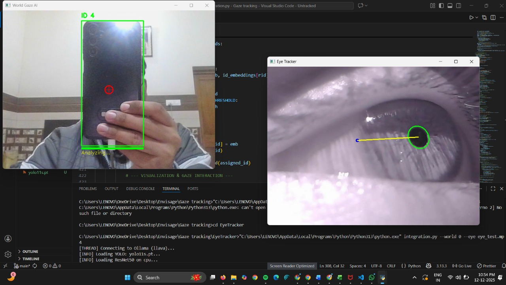

# AR Glasses — Gaze-Directed Object Detection

A wearable AR research prototype that combines **real-time eye-gaze tracking** with **object detection**, so the system can identify *the object a user is actually looking at* — not just everything in the frame. Built at the **Centre for Innovation (CFI), IIT Madras**.



-->

---

## What it does

Most object detectors label everything in view. This project adds **intent**: by tracking where the wearer is looking and intersecting that gaze point with detected objects, the glasses can surface information about the *specific* object of attention. The pipeline runs in two cooperating modules whose outputs are fused in real time.

| Stage | What happens |
|---|---|
| **Gaze tracking** | A camera captures the eye; the pupil is located via ellipse fitting (OpenCV) and converted into a gaze vector / on-screen gaze point. |
| **Object detection** | A YOLOv11 model detects objects in the forward-facing scene and returns bounding boxes + classes. |
| **Fusion** | The gaze point is mapped onto the scene frame and matched against detection boxes to determine the object being looked at. |
| **Interface** | Results are surfaced through the display/interface layer for the AR experience. |

## Repository structure

| Path | Purpose |
|---|---|
| `gaze/` | Gaze-tracking module (eye capture, pupil/ellipse detection, gaze estimation) |
| `gaze_clips/` | Sample eye-tracking recordings for testing/calibration |
| `object/` | Object-detection module (YOLOv11 inference on the scene camera) |
| `OPENH_interface/` | Interface / display layer for presenting results |
| `ellipsecenter_record.py` | Records pupil ellipse-center data for gaze calibration |
| `vector_11.py` | Computes the gaze vector / gaze-point estimation |
| `record2.py` | Capture/recording utility |
| `yolo11n.pt`, `yolo11s.pt` | Pre-trained YOLOv11 weights (nano / small) |

## Tech stack

- **Language:** Python
- **Computer vision:** OpenCV (pupil detection, ellipse fitting, frame handling)
- **Object detection:** Ultralytics YOLOv11 (`yolo11n` / `yolo11s`)
- **Hardware target:** AR glasses with an eye-facing camera + a forward scene camera

## Getting started

```bash
# Clone
git clone https://github.com/aronyyy/AR-glasses.git
cd AR-glasses

# Set up a Python environment
python -m venv venv
source venv/bin/activate          # Windows: venv\Scripts\activate
pip install opencv-python ultralytics numpy

# Run the gaze recorder (example — adjust to your camera index/entry point)
python ellipsecenter_record.py

# Run object detection (example)
python object/<detection_script>.py
```
> Adjust camera indices, file paths, and entry points to match your hardware setup.

## How it works (a bit more detail)

1. **Calibration** — the user looks at known points; `ellipsecenter_record.py` records pupil positions to build the gaze mapping.
2. **Gaze estimation** — `vector_11.py` turns the live pupil position into a gaze direction / point in the scene frame.
3. **Detection** — YOLOv11 runs on the scene camera, returning labeled boxes.
4. **Attention fusion** — the gaze point is tested against detection boxes; the matched object is the user's focus.

## Status & roadmap

Research prototype developed at CFI, IIT Madras. Possible next steps: tighter gaze-to-scene calibration, on-device latency optimization, a packaged demo, and quantitative accuracy/latency benchmarks.

## Team

Built by the AR Glasses project team at the **Centre for Innovation (CFI), IIT Madras**.

Devansh Goel
Karan Kumar 
Aarush

---

*A computer-vision project exploring gaze-aware augmented reality — pairing eye tracking with object detection to model user attention.*
